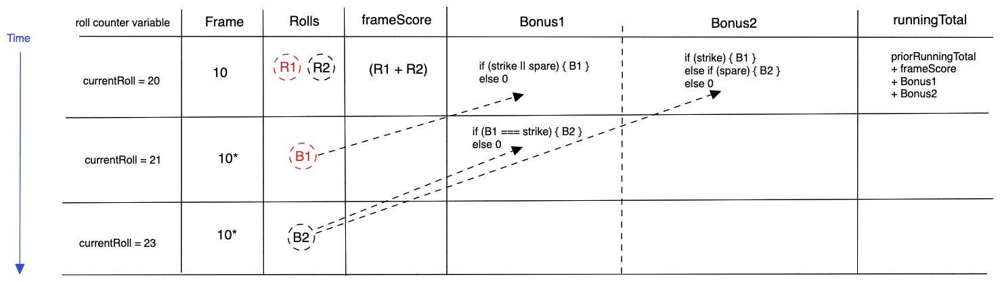

# Bowling Scorecard

This is a program that counts and sums the scores of a bowling game for one player.


### Design

A bowling game consists of 10 frames in which the player tries to knock down the 10 pins. In every frame the player can roll one or two times. The actual number depends on strikes and spares. The score of a frame is the number of knocked down pins plus bonuses for strikes and spares. After every frame the 10 pins are reset.


If the player rolls a strike or spare in the 10th frame they can roll the additional balls for the bonus. But they can never roll more than 3 balls in the 10th frame. The additional rolls only count for the bonus not for the regular frame count.

    10, 10, 10 in the 10th frame gives 30 points (10 points for the regular first strike and 20 points for the bonus).
    1, 9, 10 in the 10th frame gives 20 points (10 points for the regular spare and 10 points for the bonus).



## How to use

### To set up the project
Clone this repository and then run:
```
[TBD]
```

### To run the app:
```
[TBD]
```

### To run tests:
```
jest
```

### To run linting:
```
[ES lint?]
```

### Technology

- Language: Javascript
- Test Framwork: jest